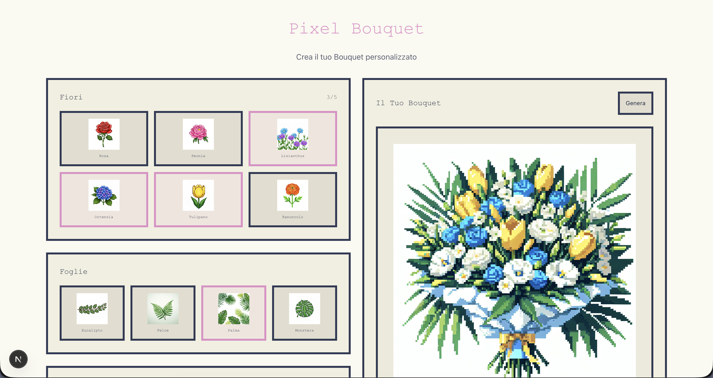
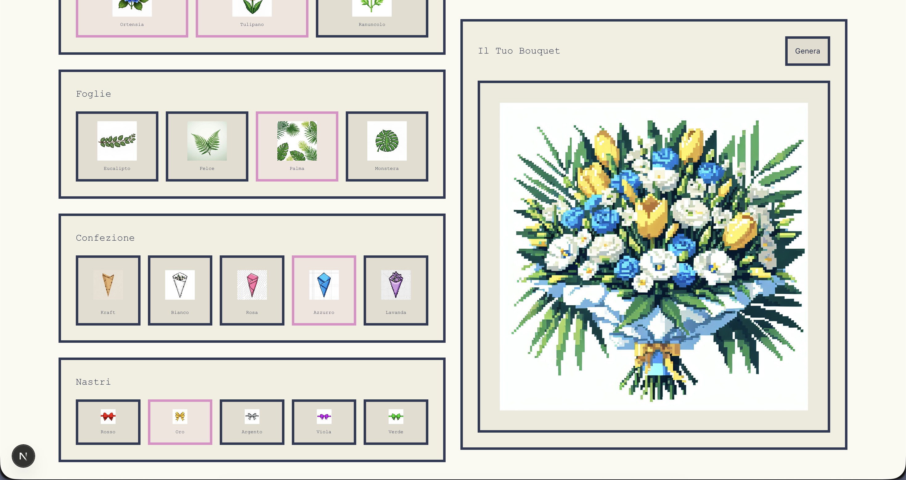

💐 AI Bouquet Builder
AI Bouquet Builder is an experimental front-end web app that allows users to create custom floral arrangements. Unlike traditional builders that stack static PNG layers, this project leverages the OpenAI API to generate unique, organic, and artistically cohesive bouquets based on user-selected parameters.
The project blends design, state management, and Generative AI, with a strong focus on rapid iteration and the "vibecoding" philosophy.

🚀 Why this project exists
This app was built using a vibecoding approach, with the goal of learning how to effectively integrate AI-powered coding tools (such as v0, Bolt, Cursor) and Generative Image Models into a modern development workflow.
Instead of treating AI simply as a code generator, I used it as:
Creative Engine: Generating the final artwork by interpreting natural language and user preferences.
Thinking Partner: Structuring complex prompts to ensure visual consistency across different floral combinations.
Rapid Prototyping Assistant: Exploring multiple UI and architectural solutions in hours rather than days.
⏱️ Development Timeline
First Prototype (Layer-based): Built in ~3 hours on January 31st, 2025.
AI Evolution (Generative): Transitioned from stacking static assets to a dynamic generation flow via OpenAI, allowing for realistic lighting, depth, and organic compositions.

✨ Features
🎨 Pixel-Art Inspired UI: A clean, nostalgic interface for a modern generative backend.
🧠 OpenAI Integration: Uses DALL-E API to synthesize the bouquet into a single, high-quality image.
🌼 Semantic Selection: Pick flowers, foliage, wrapping paper, and ribbons, which are then translated into an optimized AI prompt.
🌈 Beyond Layers: No more "floating" assets. The AI handles shadows, overlapping petals, and reflections naturally.
⚡ Real-Time Orchestration: React state management seamlessly handles the transition from user choice to API request.
🧠 Technical Overview

Framework: React + TypeScript
Styling: Tailwind CSS
AI Engine: OpenAI API
State Management: React Hooks (useState, useEffect)
The Architectural Shift:
Old Way (Manual Stacking): Base Layer + Leaf Layer + Flower Layer = Static Visual.
New Way (AI Synthesis): User Input → Prompt Engineering → OpenAI API → One-of-a-kind organic masterpiece.

🔮 Roadmap
🎨 Style Presets: Allow users to choose between "Pixel Art", "Watercolor", or "Photorealistic" styles.
📱 Mobile Optimization: Full responsiveness for creation on the go.
🛒 E-commerce Bridge: A dedicated flow to turn the digital bouquet into a real-world delivery.
🖼️ Gallery & Socials: Save and share generated bouquets in a community gallery.
🧪 What I learned
How to orchestrate Generative AI APIs within a reactive front-end environment.
The efficiency of vibecoding: moving from concept to a functional AI-powered app in record time.
The design benefits of AI Synthesis over static asset layering for personalized products.

📌 Final notes
AI Bouquet Builder is both a learning experiment and a creative playground. It represents my approach to modern development: design-first, fast iteration, and the strategic use of AI tools.

🛠️ Local Setup
Clone the repo.
Create a .env file and add your OPENAI_API_KEY.
Run npm install and npm run dev.
If you find this project interesting, feel free to leave a ⭐!

